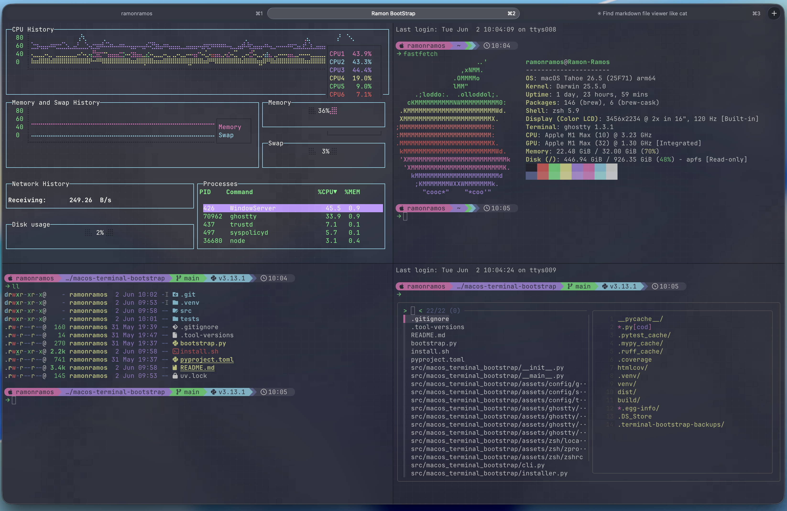

# macos-terminal-bootstrap

<p align="center">
  
</p>

Bootstrap das configuracoes de terminal que estao funcionando neste Mac:

- Ghostty com tema Dracula, cursor warp, typed scramble e noise sutil.
- Zsh com Oh My Zsh, `git`, `zsh-autosuggestions`, `zsh-syntax-highlighting`.
- Starship com a paleta Dracula lean.
- Modern CLI tooling: `fzf`, `fd`, `bat`, `eza`, `zoxide`, `glow`.
- Arquivos locais opcionais para aliases, tokens e configuracoes de trabalho.

O projeto nao versiona segredos. Tokens, private keys e variaveis sensiveis devem ficar em:

```sh
~/.config/ramon-terminal/zsh/secrets.zsh
```

## Instalacao em um Mac novo

1. Clone/baixe este repositorio e rode o bootstrap.

```sh
cd ~/Developer/personal/python/macos-terminal-bootstrap
./install.sh
```

O `install.sh` instala Homebrew quando necessario, instala `asdf`, instala Python e `uv` pelo ASDF e entao roda o instalador via `uv run`.

2. Abra o Ghostty ou recarregue a config com `Cmd+R`.

Se quiser revisar antes de aplicar:

```sh
uv run ramon-terminal-bootstrap plan
uv run ramon-terminal-bootstrap install --dry-run
```

## Comandos

```sh
uv run ramon-terminal-bootstrap plan
uv run ramon-terminal-bootstrap install
uv run ramon-terminal-bootstrap install --dry-run
uv run ramon-terminal-bootstrap doctor
```

Depois de instalar em modo editavel:

```sh
uv pip install -e .
ramon-terminal-bootstrap doctor
```

## O que o instalador faz

- Instala Homebrew quando chamado via `./install.sh`.
- Instala `asdf` via Homebrew antes de rodar o bootstrap.
- Instala Python e `uv` pelo ASDF antes de executar o projeto.
- Instala pacotes via Homebrew quando `brew` esta disponivel: `git`, `starship`, `asdf`, `fzf`, `fd`, `bat`, `eza`, `zoxide`, `glow`, `pipx`, `ghostty` e `font-hack-nerd-font`.
- Clona Oh My Zsh e os plugins customizados quando nao existem.
- Adiciona plugins ASDF para `rust`, `uv`, `nodejs`, `python` e `terraform`, depois roda `asdf install`.
- Copia configs para:
  - `~/.config/ghostty/config`
  - `~/.config/ghostty/typed_scramble.glsl`
  - `~/.config/ghostty/ghostty-cursor-shaders/cursor_warp.glsl`
  - `~/.config/ghostty/ghostty-shaders/mnoise.glsl`
  - `~/.config/starship.toml`
  - `~/.config/glow/dracula-preview.json`
  - `~/.zshrc`
  - `~/.zprofile`
  - `~/.tool-versions`
- Faz backup de qualquer arquivo existente antes de sobrescrever:

```sh
~/.terminal-bootstrap-backups/<timestamp>/
```

## Segredos e arquivos locais

O `.zshrc` instalado carrega estes arquivos se existirem:

```sh
~/.config/ramon-terminal/zsh/local.zsh
~/.config/ramon-terminal/zsh/secrets.zsh
```

Use `local.zsh` para aliases e funcoes sem segredo. Use `secrets.zsh` para tokens e variaveis sensiveis. O instalador cria somente um `local.zsh` seguro se ele ainda nao existir.

## Fora do escopo

Este repo nao configura identidade Git, GitHub CLI, assinatura de commits, nem SSH keys. Isso deve ficar em um bootstrap separado para Git/SSH pessoal, evitando misturar setup visual de terminal com credenciais e identidade.

Checklist manual apos instalar este repo:

- Criar ou restaurar a SSH key pessoal.
- Cadastrar a public key no GitHub pessoal.
- Rodar `gh auth login` com a conta pessoal.
- Configurar `git config --global user.name` e `git config --global user.email`.
- Preencher `~/.config/ramon-terminal/zsh/secrets.zsh` com tokens necessarios.

## Desenvolvimento

```sh
uv run python -m unittest discover -s tests
uv run python -m compileall src tests
```
