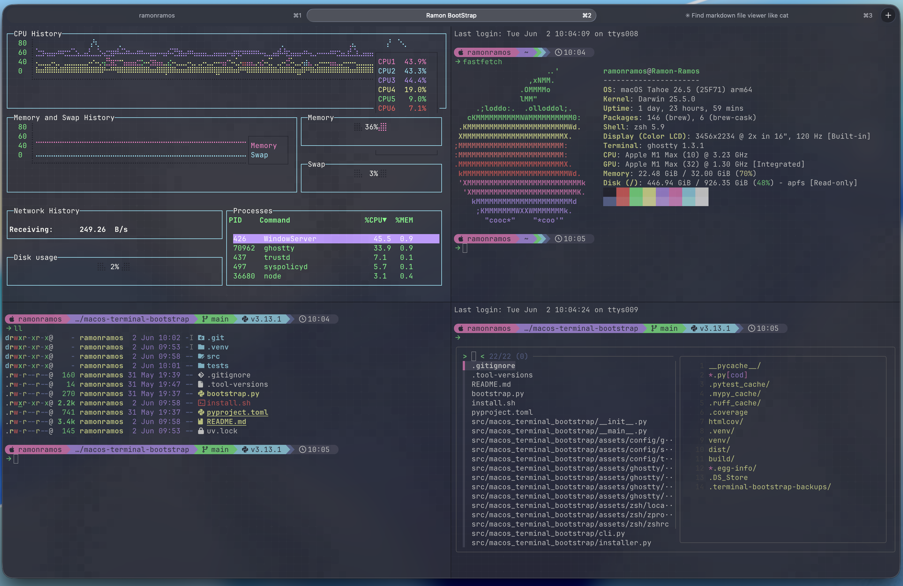

# macos-terminal-bootstrap

<p align="center">
  
</p>

Bootstrap the terminal setup currently used on this Mac:

- Ghostty with the Dracula theme, cursor warp, subtle noise, and 93% background opacity.
- Zsh with Oh My Zsh, `git`, `zsh-autosuggestions`, and `zsh-syntax-highlighting`.
- Starship with a lean Dracula palette.
- Modern CLI tooling: `fzf`, `fd`, `bat`, `eza`, `zoxide`, `glow`.
- Optional local files for aliases, tokens, and work-specific settings.

This project does not version secrets. Tokens, private keys, and sensitive environment variables should live in:

```sh
~/.config/ramon-terminal/zsh/secrets.zsh
```

## Installation On A New Mac

1. If migrating, transfer your private `secrets.zsh` to Downloads on the new
Mac (for example, using AirDrop). On the old Mac, the intended location is
`~/.config/ramon-terminal/zsh/secrets.zsh`. If it does not exist, collect only
the required secret exports from your existing shell configuration. Resolve
references to old project `.env` files before transferring; do not copy your
entire old `.zshrc` or commit credentials to this repository.

2. In Terminal on the **new Mac**, install the transferred file:

```sh
mkdir -p ~/.config/ramon-terminal/zsh
install -m 600 ~/Downloads/secrets.zsh ~/.config/ramon-terminal/zsh/secrets.zsh
```

Skip this step if you do not need private environment variables. If you already
have a secrets file on the new Mac, merge the required exports instead of
overwriting it. Non-secret customizations belong in `local.zsh` alongside it.

3. Paste this block into Terminal from any directory; no GitHub login or clone
is required:

```zsh
(
  set -e
  setup_dir="$(mktemp -d)"
  curl -fsSL \
    https://github.com/ramonlimaramos/macos-terminal-bootstrap/archive/refs/heads/main.tar.gz \
    -o "$setup_dir/bootstrap.tar.gz"
  tar -xzf "$setup_dir/bootstrap.tar.gz" -C "$setup_dir"
  /bin/zsh "$setup_dir/macos-terminal-bootstrap-main/install.sh"
)
```

Alternatively, from an existing checkout:

```sh
cd ~/Developer/personal/python/macos-terminal-bootstrap
./install.sh
```

`install.sh` installs Homebrew when needed, installs `asdf`, installs Python and `uv` through ASDF, and then runs the installer through `uv run`.

The installer may request your macOS password and installation confirmations.
Paths use `~` and `$HOME`: a new account named `ramon.ramos` works even if the
old account was named `ramonramos`. Review absolute paths in your own local files.

4. Open a new terminal window to load the configuration and secrets. Open
Ghostty or reload its config with `Cmd+R`.

To review before applying:

```sh
uv run ramon-terminal-bootstrap plan
uv run ramon-terminal-bootstrap install --dry-run
```

## Commands

```sh
uv run ramon-terminal-bootstrap plan
uv run ramon-terminal-bootstrap install
uv run ramon-terminal-bootstrap install --dry-run
uv run ramon-terminal-bootstrap doctor
```

After installing in editable mode:

```sh
uv pip install -e .
ramon-terminal-bootstrap doctor
```

## Updating An Existing Mac

After installing this version, get all subsequent changes merged into this
repository's `main` branch with:

```sh
ramon-terminal-update
```

If the command is not found, open a new terminal or use
`~/.local/bin/ramon-terminal-update`. For installations made before this command
existed, run the download-and-install block under **Installation On A New Mac**
once (skip the secrets-transfer step). No Git clone or GitHub login is needed.

The updater downloads the latest `main`, runs its installer, then removes the
temporary download. This reapplies managed configs and shaders, installs missing
dependencies and the tool versions declared by the repository, and updates the
updater itself. It does not run a global Homebrew upgrade or pull existing
third-party plugin checkouts. Updates to this repository are distinct from
upgrading every application installed on the Mac.

Changed managed files are backed up under `~/.terminal-bootstrap-backups/`.
`secrets.zsh`, existing `local.zsh`, and `~/.config/ghostty/local.conf` are
preserved. Put personal changes in these local files: direct edits to managed
files such as `.zshrc` or Ghostty's `config` are replaced by repository defaults.

After updating, open a new shell and press **Cmd+R** in Ghostty. Fully quit and
reopen Ghostty if shader changes are not visible. These effects apply to
**Ghostty**, not the macOS Terminal app.

### Ghostty Appearance And Overrides

The defaults match the reference Mac: `cursor_warp` followed by `mnoise`,
animation enabled, opacity `0.93`, blur `45`, Dracula, and a block cursor.
`typed_scramble.glsl` remains installed for optional use but is no longer
enabled by default. Split resizing uses Cmd+Shift+arrows or H/J/K/L;
Cmd+Shift+0 equalizes splits. Cmd+Shift+[ and ] pass through to terminal apps.

Put optional Ghostty overrides in `~/.config/ghostty/local.conf`; updates keep
this file. For example, to opt back into the previous shader stack:

```ini
custom-shader =
custom-shader = ghostty-cursor-shaders/cursor_warp.glsl
custom-shader = typed_scramble.glsl
custom-shader = ghostty-shaders/mnoise.glsl
```

Ghostty also loads configuration from
`~/Library/Application Support/com.mitchellh.ghostty/`, and newer versions
support `config.ghostty` alongside `config`. Existing files there may override
managed settings. The installer leaves them untouched. Inspect effective
settings if two Macs still differ:

```sh
/Applications/Ghostty.app/Contents/MacOS/ghostty +version
/Applications/Ghostty.app/Contents/MacOS/ghostty +validate-config
/Applications/Ghostty.app/Contents/MacOS/ghostty +show-config
```

See Ghostty's [configuration locations and overrides](https://ghostty.org/docs/config).

## What The Installer Does

- Installs Homebrew when called through `./install.sh`.
- Installs `asdf` through Homebrew before running the bootstrap.
- Installs Python and `uv` through ASDF before executing the project.
- Installs Homebrew packages when `brew` is available: `git`, `starship`, `asdf`, `fzf`, `fd`, `bat`, `eza`, `zoxide`, `glow`, `pipx`, `ghostty`, and `font-hack-nerd-font`.
- Clones Oh My Zsh and custom plugins when they do not exist.
- Adds ASDF plugins for `rust`, `uv`, `nodejs`, `python`, and `terraform`, then runs `asdf install`.
- Copies configs to:
  - `~/.config/ghostty/config`
  - `~/.config/ghostty/typed_scramble.glsl`
  - `~/.config/ghostty/ghostty-cursor-shaders/cursor_warp.glsl`
  - `~/.config/ghostty/ghostty-shaders/mnoise.glsl`
  - `~/.config/starship.toml`
  - `~/.config/glow/dracula-preview.json`
  - `~/.zshrc`
  - `~/.zprofile`
  - `~/.tool-versions`
  - `~/.local/bin/ramon-terminal-update`
- Backs up any existing file before overwriting it:

```sh
~/.terminal-bootstrap-backups/<timestamp>/
```

## Secrets And Local Files

The installed `.zshrc` loads these files when they exist:

```sh
~/.config/ramon-terminal/zsh/local.zsh
~/.config/ramon-terminal/zsh/secrets.zsh
```

Use `local.zsh` for aliases and functions that do not contain secrets. Use `secrets.zsh` for tokens and sensitive environment variables. The installer only creates a safe `local.zsh` when it does not already exist.

## Out Of Scope

This repository does not configure Git identity, GitHub CLI authentication,
commit signing, SSH keys, or corporate access. Continue with
[ramon-git-bootstrap](https://github.com/ramonlimaramos/ramon-git-bootstrap)
for Git/GitHub/SSH setup. Installing this project does not replicate all
applications or credentials from the old Mac.

Manual checklist after installing this repository:

- Create or restore the personal SSH key.
- Add the public key to the personal GitHub account.
- Run `gh auth login` with the personal account.
- Configure personal/professional identities through the Git bootstrap.
- Fill `~/.config/ramon-terminal/zsh/secrets.zsh` with the required tokens.

## Development

```sh
zsh -n install.sh
shellcheck --shell=bash --exclude=SC1091 install.sh
zsh tests/test_bootstrap.zsh
zsh tests/test_update.zsh
uv run python -m unittest discover -s tests
uv run python -m compileall src tests
```
